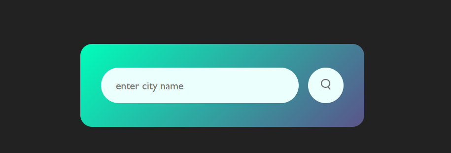
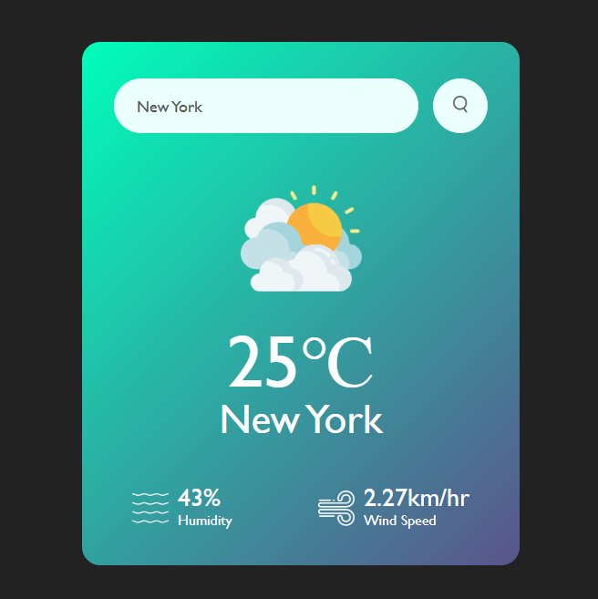
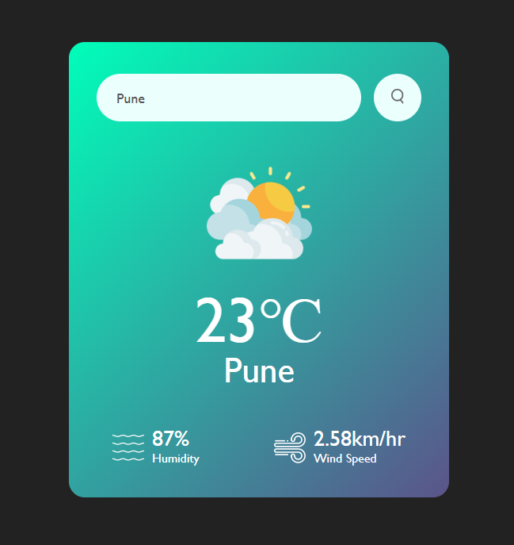

# 🌦️ Weather App

A beginner-friendly and responsive Weather App built using **HTML**, **CSS**, and **Vanilla JavaScript**.  
It fetches real-time weather data using the **OpenWeatherMap API** and displays the current temperature, humidity, and wind speed based on user input.

> 🎓 Built by Sarvesh Jain — Pre-final year B.Tech CSE Student

---

## 📸 Demo Screenshots

> Below are a few demo images of the project interface:
### 🌤️ Home Page
 

### 🔍 Weather App - Demo 2(City Search Example)

### 🔍 Weather App - Demo 3
  

---

## ✨ Features

- 🔍 Search weather by city name
- 🌡 Real-time temperature (in Celsius)
- 💧 Displays humidity
- 🌬️ Displays wind speed
- 📱 Responsive UI for both desktop and mobile

---

## 🧰 Tech Stack

- HTML5
- CSS3
- JavaScript (ES6)
- OpenWeatherMap API

---
## 🎦 Project Structure

weather-app/
├── index.html               # Main structure of the webpage
├── style.css                # CSS styles
├── script.js                # JavaScript logic (API, DOM updates)
├── README.md                # Project documentation
└── Assets/
    ├── Images used in code:
    │   ├── clear.png
    │   ├── clouds.png
    │   ├── drizzle.png
    │   ├── humidity.png
    │   ├── mist.png
    │   ├── rain.png
    │   ├── search.png
    │   ├── snow.png
    │   └── wind.png
    └── Screenshots for README:
        ├── screenshot1.png
        ├── screenshot2.png
        └── screenshot3.png

